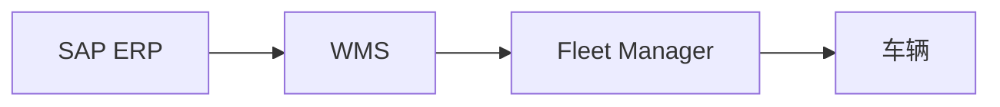

# SAP ERP 加独立 WMS

一条串行链：SAP，然后 WMS，然后 Fleet Manager，然后车辆。库位和托盘在 WMS 内部，不另成一个系统。Fleet Manager 本实验用 openTCS。

高清原图、英文版、PDF 和 SVG 在本目录。文件名以 `_zh` 结尾的是中文，以 `_en` 结尾的是英文。

## 调用方向

```mermaid
flowchart LR
  SAP["SAP ERP"] --> WMS["WMS"] --> FM["Fleet Manager"] --> CAR["车辆"]
```

