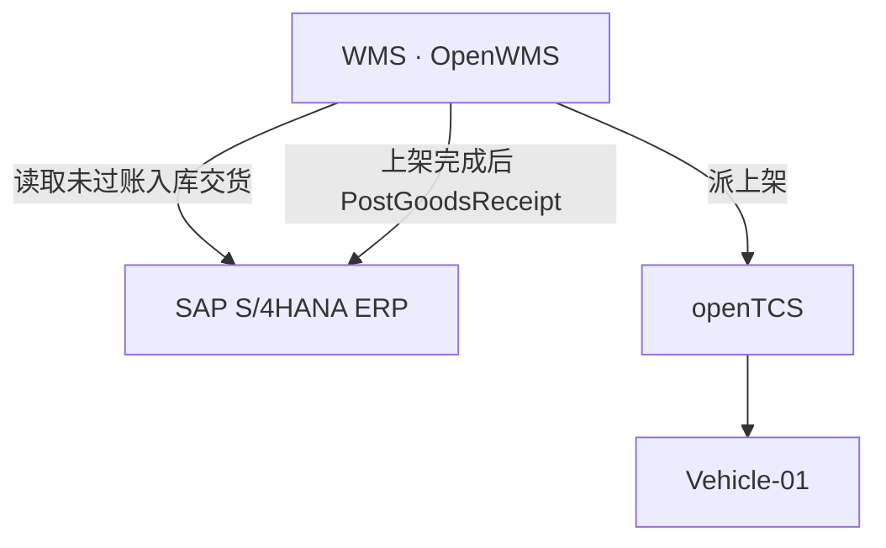

# SAP ERP 加独立 WMS

没有桥接。WMS 直接调用 SAP 的入库交货和收货过账。库位对照是 WMS 自己的主数据。

高清原图、英文版、PDF 和 SVG 在本目录。文件名以 `_zh` 结尾的是中文，以 `_en` 结尾的是英文。

## 调用方向

```mermaid
flowchart TB
  SAP["SAP S/4HANA ERP"]
  WMS["WMS · OpenWMS"]
  TCS["openTCS"]
  CAR["Vehicle-01"]
  WMS -->|"读取未过账入库交货"| SAP
  WMS -->|"上架完成后 PostGoodsReceipt"| SAP
  WMS -->|"派上架"| TCS --> CAR
```

